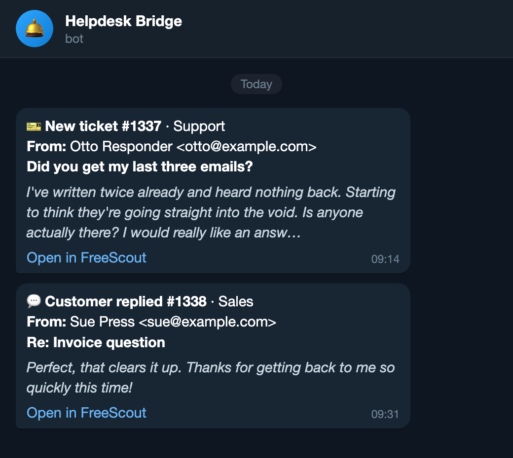

# FreeScout → Telegram notification bridge

[](https://github.com/cloudlineas/freescout-telegram-bridge/actions/workflows/ci.yml)
[](https://github.com/cloudlineas/freescout-telegram-bridge/pkgs/container/freescout-telegram-bridge)
[](LICENSE)

A small, self-hosted webhook receiver that turns FreeScout helpdesk events into
Telegram messages.

```
FreeScout ──webhook (internal network)──> bridge ──HTTPS──> Telegram
```

<p align="center">
  
</p>

## Why not just use email notifications?

Because email notifications fail silently, and the failure is invisible from the
FreeScout side.

If your helpdesk sends its own notifications from an address at the same domain
it receives on, and that domain is relayed through a transactional provider,
then one spam ticket hard-bouncing at your mailbox provider is enough to get
*you* added to the relay's suppression list. From that point every notification
is dropped — while your MTA still logs `250 OK`. Nothing alerts you. You find
out when someone asks why you never replied.

That has happened to this setup twice; the second time cost 65 notifications
over three weeks before anyone noticed. A webhook removes the whole class of
problem: there is no bounce, no suppression list, and a failed delivery is
recorded in FreeScout's own webhook log instead of vanishing.

## Requirements

- A FreeScout install with the **API & Webhooks** module. This is a **paid**
  module (one-time licence for a single instance) from FreeScout's module
  directory. The bridge needs it for outgoing webhooks and their signatures.
  Once installed: `Manage → Modules → API & Webhooks → Activate`.
- Docker, or any way to run a Python WSGI app.
- A Telegram account.

> **Consider the official module first.** FreeScout sells a
> [Telegram Notifications module](https://freescout.net/module/telegram/) that
> covers more events, maps mailboxes to different chats, and needs no extra
> service running. If you only want Telegram notifications, that is less work
> than this and costs about the same.
>
> This bridge is worth it when you already have API & Webhooks for other
> reasons, want the notification path isolated in its own container instead of
> running inside FreeScout, or want full control over the message format.

## 1. Telegram setup (do this first, on your phone)

**a. Create the bot.** Message [@BotFather](https://t.me/BotFather) → `/newbot` →
pick a name and username. He replies with a token like `123456789:AAE...`.
That's `TELEGRAM_BOT_TOKEN`.

**b. Get your chat ID.** Send your new bot any message — bots cannot message you
until you've talked to them first. Then:

```bash
curl -s "https://api.telegram.org/bot<TOKEN>/getUpdates" | python3 -m json.tool
```

Take `result[0].message.chat.id` — that's `TELEGRAM_CHAT_ID`. For a group, add
the bot to the group first; the ID will be negative.

## 2. Get the webhook signing secret (run on your FreeScout host)

FreeScout signs each webhook with a key derived from its own `APP_KEY`:

```
X-FreeScout-Signature: base64(hmac_sha1(raw_body, md5(APP_KEY . "webhook_key")))
X-FreeScout-Event:     convo.created
```

(see `Modules/ApiWebhooks/Entities/Webhook.php`). Note that `APP_KEY` includes
its literal `base64:` prefix — it is hashed as-is. This one-liner reproduces the
value Laravel computes:

```bash
docker exec freescout sh -c 'printf "%s" "$(grep "^APP_KEY=" /www/html/.env | cut -d= -f2-)webhook_key" | md5sum | cut -d" " -f1'
```

If you don't run FreeScout in Docker, hash `<APP_KEY>webhook_key` from its
`.env` the same way. That value is `FREESCOUT_WEBHOOK_SECRET`. **Treat it as a
credential** — it is derived from your application key.

## 3. Configuration

| Variable | Required | Default | Meaning |
| --- | --- | --- | --- |
| `TELEGRAM_BOT_TOKEN` | yes | — | From @BotFather. |
| `TELEGRAM_CHAT_ID` | yes | — | Numeric user or group ID. |
| `FREESCOUT_WEBHOOK_SECRET` | yes | — | From step 2. |
| `FREESCOUT_URL` | no | *(empty)* | Base URL of your FreeScout. Builds the "Open in FreeScout" link; empty omits the link. |
| `EVENTS` | no | `convo.created,convo.customer.reply.created` | Comma-separated events that produce a message. Anything else is dropped. |
| `MAILBOX_NAMES` | no | *(empty)* | `1:Support,2:Sales` — shows a mailbox label in the header. |
| `PREVIEW_CHARS` | no | `160` | Body preview budget in characters. The body is collapsed to one paragraph before truncating. |
| `TELEGRAM_TIMEOUT` | no | `10` | Seconds to wait on the Bot API. |
| `LOG_LEVEL` | no | `INFO` | Standard Python levels. |
| `VERIFY_SIGNATURE` | no | `true` | Set `false` **only** to debug a signature mismatch locally. |

## 4. Run it

### With the published image

```bash
docker run -d --name freescout-telegram --env-file .env \
  ghcr.io/cloudlineas/freescout-telegram-bridge:0.2.1
```

Images are multi-arch (`linux/amd64`, `linux/arm64`). Pin a version tag rather
than `latest`.

> Image tags carry no `v` prefix, even though git tags do: the release `v0.2.1`
> publishes `:0.2.1`, `:0.2` and `:latest`.

### Alongside FreeScout in Compose

`compose-service.yml` contains a ready service block. Paste it into the
`services:` section of the compose file that already runs FreeScout, put the
secrets in that stack's `.env`, and bring up only the new container:

```bash
docker compose up -d freescout-telegram
```

It publishes no ports and carries no reverse-proxy labels — only the FreeScout
container needs to reach it, over their shared internal network.

> `environment` and `env_file` values are read at container **creation**. A
> `docker compose restart` will not pick up new `.env` values — always use
> `docker compose up -d`.

### Register the webhook

In FreeScout: **Manage → API & Webhooks → Webhooks → New Webhook**

- URL: `http://freescout-telegram:8080/freescout`
- Events: `convo.created` and `convo.customer.reply.created`

Then send yourself a test email at your support address and confirm the Telegram
message arrives.

## 5. Testing locally

```bash
cp .env.example .env      # fill in the three required values
docker compose -f docker-compose.dev.yml up --build -d
docker compose -f docker-compose.dev.yml logs -f
```

`send_test_webhook.py` posts a correctly-signed fake webhook, so you can prove
the whole path without waiting for a real ticket:

```bash
curl -s localhost:8080/healthz

python3 send_test_webhook.py                                  # 200, message delivered
python3 send_test_webhook.py --bad-signature                  # 401, nothing sent
python3 send_test_webhook.py --event convo.customer.reply.created
python3 send_test_webhook.py --event convo.status             # 200 "ignored", nothing sent
```

The fake payload mirrors the real `formatEntity()` conversation shape and
includes a `<script>` tag in the subject, so it also demonstrates HTML escaping.

Tear down with `docker compose -f docker-compose.dev.yml down`.

## FAQ

### The "Open in FreeScout" link opens in Telegram's in-app browser. Can the bridge force my real browser?

**No, and please don't try.** Whether a link opens in-app or in the system
browser is a **client-side setting**. There is no Bot API parameter for it —
neither `sendMessage` nor `InlineKeyboardButton` exposes one.

Custom URL schemes do not work either. `x-safari-https://` and `intent://`
hrefs are *accepted* by the Bot API (it returns `ok:true`) but **stripped by the
mobile client**, leaving plain unclickable text. A successful API response is
therefore not evidence the link works — it has to be tapped on a real device.
This was tried and removed; the link stays plain `https://`.

The actual fix is one-time, per device:

- **iOS:** Settings → Data and Storage → *Open Links In* → pick your browser
- **Android:** Settings → Chat Settings → disable *In-App Browser*

### Can it notify Signal / ntfy / Slack instead?

Not today. This is deliberately a focused Telegram bridge rather than a
half-finished notification framework. `build_message()` and `send_to_telegram()`
are already a clean seam if you want to fork it.

### Why does it return 502 instead of swallowing errors?

By design — see below.

## Design notes

- **Not exposed publicly.** Internal network only, no published ports, no
  reverse-proxy labels. Reachable solely from the FreeScout container.
- **Signatures are verified** with `hmac.compare_digest`. Unsigned, empty or
  wrongly-signed requests get 401 and send nothing.
- **Failures are loud.** If Telegram rejects a message or is unreachable, the
  bridge returns **502** so FreeScout records it in its webhook log. Returning
  200 on failure would recreate the exact silent-drop bug this replaces.
- **Unknown events are acknowledged with 200 and dropped**, so subscribing to an
  extra event in the FreeScout UI can never wedge delivery.
- **Everything interpolated into a message is HTML-escaped.**
- Runs as a non-root user (uid 10001); the base image is pinned by digest.

## Rollback

Remove the webhook in the FreeScout UI — notifications stop and nothing else is
affected — then `docker compose stop freescout-telegram`. The bridge is entirely
independent of FreeScout's operation: if it is down, tickets still arrive
normally.

## Contributing

See [CONTRIBUTING.md](CONTRIBUTING.md).

## License

MIT — see [LICENSE](LICENSE).
